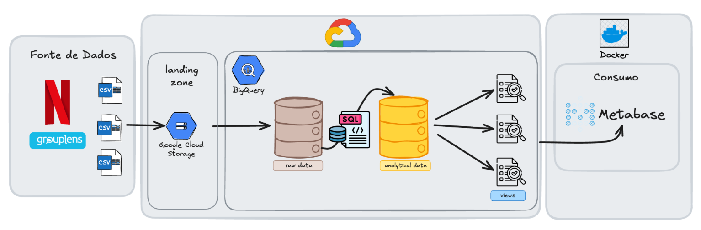
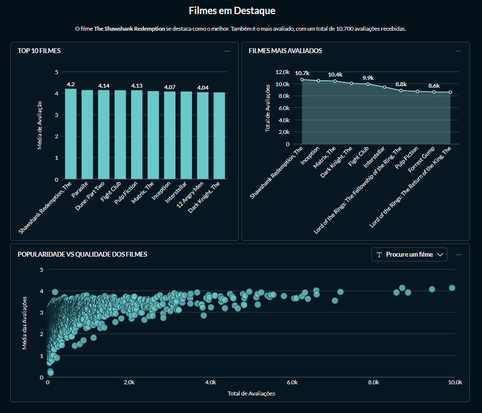

# 🎬 Movie Analytics Pipeline
 


 
An end-to-end data analytics pipeline built with **Google Cloud Storage**, **BigQuery**, **SQL**, **Docker**, and **Metabase**, following the **Medallion Architecture** to transform raw CSV files into analytical datasets and interactive dashboards.
 
---
 
# 📌 Project Overview
 
This project demonstrates the development of a complete cloud-based analytics pipeline using the **MovieLens Belief Dataset**.
 
The pipeline begins with CSV files stored in **Google Cloud Storage (GCS)**, which are accessed in **BigQuery** through External Tables. The raw data is transformed into analytical tables using SQL and organized according to the Medallion Architecture. Finally, analytical views are created to support interactive dashboards built in **Metabase**, running in a Docker container.
 
The project covers the complete analytics lifecycle, from data ingestion to business intelligence visualization.
 
---
 
# 🏗️ Solution Architecture
 
The following diagram illustrates the complete architecture implemented in this project.
 
<p align="center">
    
</p>
---
 
# 🚀 Technologies
 
- Google Cloud Platform (GCP)
- Google Cloud Storage (GCS)
- BigQuery
- SQL
- Docker
- Metabase
- Git & GitHub
---
 
# 📂 Repository Structure
 
```text
movie-analytics-pipeline/
│
├── demo/
│   └── dashboard_demo.mp4
│
├── images/
│   ├── demo.gif
│   ├── architecture/
│   │   └── architecture.png
│   └── dashboards/
│       ├── genres_and_users_dashboard.png
│       └── movies_dashboard.png
│
├── sql/
│   ├── raw/
│   │   └── create_raw_tables.sql
│   ├── analytics/
│   │   └── create_analytics_tables.sql
│   └── views/
│       └── create_views.sql
│
├── .gitignore
├── docker-compose.yml
├── LICENSE
└── README.md
```
 
---
 
# 📊 Dataset
 
This project uses the **MovieLens Belief Dataset**, provided by **GroupLens Research**.
 
The dataset contains information about movies, user ratings, recommendation history, and user belief data, making it suitable for building analytical models and dashboards.
 
Dataset source: https://grouplens.org/datasets/
 
---
 
# ⚙️ Project Setup
 
> **Important**
>
> Before running the SQL scripts, replace the placeholders below with the corresponding values from your Google Cloud environment:
>
> - `<PROJECT_ID>` → Your Google Cloud Project ID.
> - `<BUCKET_NAME>` → The name of your Google Cloud Storage bucket where the CSV files are stored.
 
To reproduce this project, it is necessary to:
 
1. Create a Google Cloud project.
2. Create a Google Cloud Storage bucket.
3. Upload the MovieLens CSV files to the bucket.
4. Create the following BigQuery datasets:
   - `netflix_raw`
   - `netflix_analytics`
5. Create a **Service Account** with permission to access BigQuery and generate its **JSON key**. This key will be used by Metabase to authenticate with Google Cloud.
6. Execute the SQL scripts in the following order:
   1. `sql/raw/create_raw_tables.sql`
   2. `sql/analytics/create_analytics_tables.sql`
   3. `sql/views/create_views.sql`
7. Start Metabase using Docker:
```bash
docker compose up -d
```
 
# 📈 Dashboards
 
The analytical views created in BigQuery are consumed by Metabase to build interactive dashboards for data exploration and analysis.
 
## Demo
 
The GIF below provides a brief preview of the interactive dashboard.
 

 
The complete demonstration is available [here](demo/dashboard_demo.mp4).
 
## Top Rated Movies
 

 
## Genre Performance and User Activity
 

 
---
 
# 🎯 Project Highlights
 
- End-to-end analytics pipeline
- Cloud-based architecture using Google Cloud Platform
- Google Cloud Storage as data landing zone
- BigQuery External Tables
- Medallion Architecture
- SQL-based data transformation
- Fact and Dimension modeling
- Analytical Views
- Interactive dashboards with Metabase
- Dockerized BI environment
---
 
# 👩‍💻 Author
 
**Estéfani Ferlin**
 
Feel free to connect with me on LinkedIn or explore my other repositories.
 
🔗 [LinkedIn](https://www.linkedin.com/in/estefani-ferlin/)
 
💻 [GitHub](https://github.com/estefaniferlin)
 
---
 
# 📄 License
 
This project is licensed under the MIT License. See the LICENSE file for details.